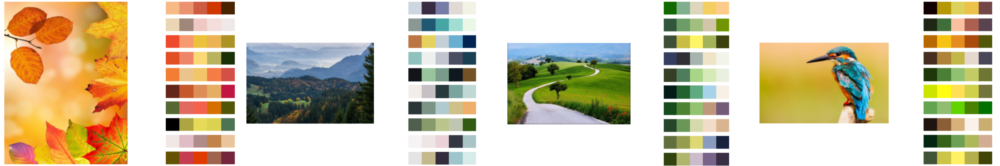

# Neural Color Spaces
## Generation and Extraction of Color Palettes with Adversarial Variational Auto Encoders


### Abstract

The process of creating a meaningful and perceptually pleasing color palette is an incredibly difficult task for the inexperienced practitioner. In this paper we show that the Variational Auto Encoder can be a powerful creative tool for the generation of novel color palettes as well as their extraction from visual mediums. Our proposed model is capable of extracting meaningful color palettes from images, and simultaneously learns an internal representation which allows for the sampling of novel color palettes without any additional input.

### Notes
- The VAE, as well as the VAE-GAN can be trained in a couple of hours on Google Colab
- Pre-trained model weights can be found in the .ZIP file named 'Pre-trained-model-weights.zip'
- Keras with Tensorflow 1.X was used
```python
%tensorflow_version 1.x
import tensorflow as tf
device_name = tf.test.gpu_device_name()
if device_name != '/device:GPU:0':
  raise SystemError('GPU device not found')
  pass
print('Found GPU at: {}'.format(device_name))
```
- To connect Google Colab to your Google Drive
```python
from google.colab import drive
drive.mount('/content/gdrive')

!ls "/content/gdrive/My Drive/path/to/dataset/and/model/weights/"
```


### Dataset
The dataset can be downloaded [from this public google drive repository](https://drive.google.com/file/d/1FvU_IvhSpues4O_Ac8Gn7dHBaX9xaxPy/view?usp=sharing)
